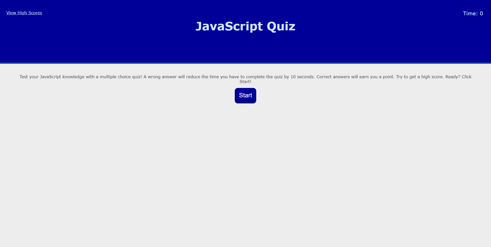
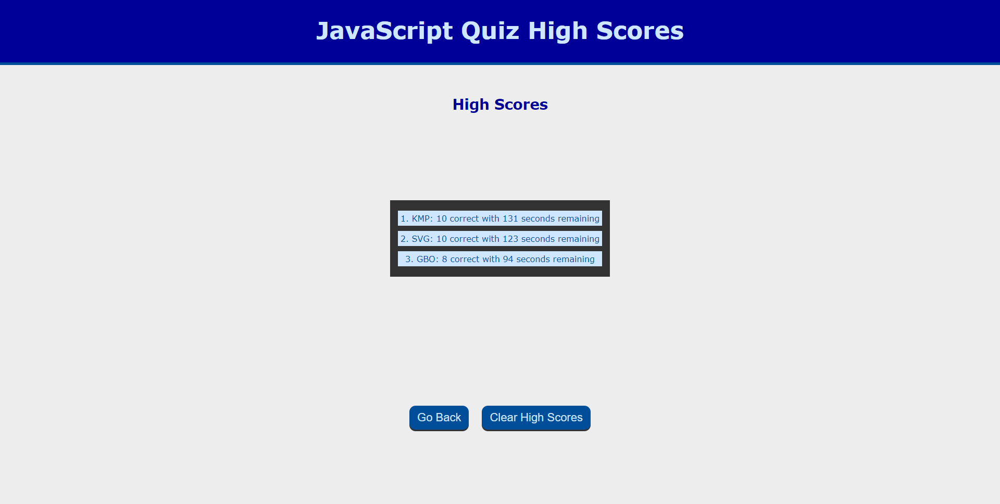

# JavaScript Quiz

## Page Description
This page engages the user in a multiple choice quiz to test knowledge in JavaScript.  The user clicks a start button, and questions are dynamically displayed on the page while a timer counts down.  The user selects an answer, is given feedback, and the next question is displayed. Wrong answers result in a penalty to the quiz timer.  The quiz is over either when the user completes all the questions or when the timer reaches zero.  When the quiz is over, the user is taken to a screen where their final score is displayed, and they enter their initials to save the score to local storage.  The user is then taken to a high score page where they can see their score and any other stored scores.  The user can either go back to the main page immediately, or they can chose to clear the high score list.  The high score page will reload after the clear data option is chosen to show the user that data has been cleared.  The quiz may be repeated as many times as desired.

## Page Link
This page is hosted at: https://kpehl.github.io/javascript-quiz/index.html 

## Tools Used
JavaScript, HTML, CSS

## Screenshots

